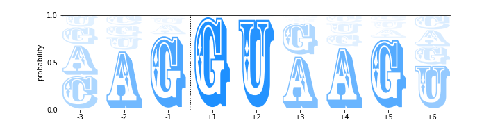
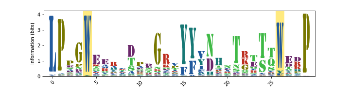
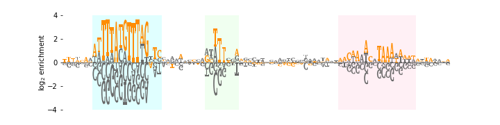
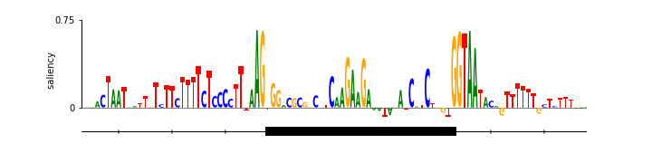
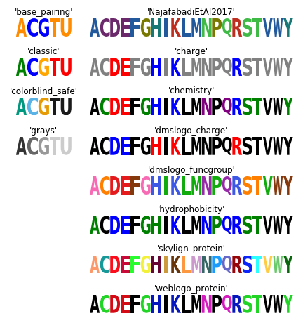

.. _examples:

Examples
========

As described in :ref:`quickstart`, the five logos shown in Figure 1 of Tareen and Kinney (2019) [#Tareen2019]_ can be generated using the function ``logomaker.demo``. Here we describe each of these logos, as well as the snippets of code used to generate them. All snippets shown below are designed for use within a Jupyter Notebook, and assume that the following header cell has already been run. ::

    # standard imports
    import numpy as np
    import pandas as pd
    import matplotlib.pyplot as plt

    # displays logos inline within the notebook;
    # remove if using a python interpreter instead
    %matplotlib inline

    # logomaker import
    import logomaker

CRP energy logo
---------------

The following code creates an energy logo for the *E. coli* transcription factor CRP. The energy matrix illustrated by this logo was reported by Kinney et. al. (2010) [#sortseq2010]_ based on the analysis of data from a massively parallel reporter assay. This energy matrix is included with Logomaker as example data, and is loaded here by calling ``logomaker.get_example_matrix`` with the argument ``'crp_energy_matrix'``. A Logo object named ``crp_logo`` is then created using the styling parameters ``shade_below``, ``fade_below``, and ``font_name``. Subsequent styling is then performed using the Logo object methods ``style_spines`` and ``style_xticks``. Additional styling is also performed using methods of ``crp_logo.ax``, the matplotlib Axes object on which the logo is drawn. ::

    # load crp energy matrix
    crp_df = -logomaker.get_example_matrix('crp_energy_matrix',
                                            print_description=False)

    # create Logo object
    crp_logo = logomaker.Logo(crp_df,
                              shade_below=.5,
                              fade_below=.5,
                              font_name='Arial Rounded MT Bold')

    # style using Logo methods
    crp_logo.style_spines(visible=False)
    crp_logo.style_spines(spines=['left', 'bottom'], visible=True)
    crp_logo.style_xticks(rotation=90, fmt='%d', anchor=0)

    # style using Axes methods
    crp_logo.ax.set_ylabel("$-\Delta \Delta G$ (kcal/mol)", labelpad=-1)
    crp_logo.ax.xaxis.set_ticks_position('none')
    crp_logo.ax.xaxis.set_tick_params(pad=-1)

.. image:: _static/examples_images/crp_energy_logo.png

Splice site probability logo
----------------------------

The following code creates a probability logo derived from all 5' splice sites annotated in the human genome [#frankish2019]_. Here the probability of each RNA nucleotide at each position is indicated by both character height and character opacity.  The dashed line indicates the intron/exon boundary, with exonic sequence on the left and intronic sequence on the right. This probability matrix is included with Logomaker as example data, and is loaded into a pandas DataFrame object named ``ss_df`` by calling ``logomaker.get_example_matrix`` with the argument ``'ss_probability_matrix'``. A Logo object named ``ss_logo`` is then created using the styling parameters ``width``, ``vpad``, ``fade_probabilities``, ``stack_order``, ``color_scheme``, and ``font_name``. Subsequent styling is performed using the Logo object method ``style_spines``, as well as multiple Axes object methods. ::

    # load ss probability matrix
    ss_df = logomaker.get_example_matrix('ss_probability_matrix',
                                         print_description=False)

    # create Logo object
    ss_logo = logomaker.Logo(ss_df,
                             width=.8,
                             vpad=.05,
                             fade_probabilities=True,
                             stack_order='small_on_top',
                             color_scheme='dodgerblue',
                             font_name='Rosewood Std')

    # style using Logo methods
    ss_logo.style_spines(spines=['left', 'right'], visible=False)

    # style using Axes methods
    ss_logo.ax.set_xticks(range(len(ss_df)))
    ss_logo.ax.set_xticklabels('%+d'%x for x in [-3, -2, -1, 1, 2, 3, 4, 5, 6])
    ss_logo.ax.set_yticks([0, .5, 1])
    ss_logo.ax.axvline(2.5, color='k', linewidth=1, linestyle=':')
    ss_logo.ax.set_ylabel('probability')

WW domain information logo
--------------------------

The following code creates an information logo derived from a multiple sequence alignment (obtained from PFam [#Finn2014]_) of protein WW domains. Here the height of each stack of characters indicates information content, as described by Schneider and Stevens (1990) [#Schneider1990]_. First, the information matrix is loaded into ``ww_df`` by calling ``logomaker.get_example_matrix`` with the argument ``'ww_information_matrix'``. A Logo object named ``ww_logo`` is then generated. Among other styling options, setting the ``color_scheme`` parameter to ``'NajafabadiEtAl2017'`` causes Logomaker to use a color scheme extracted from Najafabadi et al. (2017) [#Najafabadi2017]_; the list of all available color schemes can be viewed by calling ``logomaker.list_color_schemes()``. The Logo object method ``highlight_position`` is also used to highlight the two eponymous positions of the WW domain. ::

    # load ww information matrix
    ww_df = logomaker.get_example_matrix('ww_information_matrix',
                                         print_description=False)

    # create Logo object
    ww_logo = logomaker.Logo(ww_df,
                             font_name='Stencil Std',
                             color_scheme='NajafabadiEtAl2017',
                             vpad=.1,
                             width=.8)

    # style using Logo methods
    ww_logo.style_xticks(anchor=0, spacing=5, rotation=45)
    ww_logo.highlight_position(p=4, color='gold', alpha=.5)
    ww_logo.highlight_position(p=26, color='gold', alpha=.5)

    # style using Axes methods
    ww_logo.ax.set_ylabel('information (bits)')
    ww_logo.ax.set_xlim([-1, len(ww_df)])

ARS enrichment logo
-------------------

The following code creates an enrichment logo that illustrates the results of a mutARS-seq experiment (unpublished; performed by JBK) analogous to the one reported by Liachko et al. (2013) [#Liachko2013]_. In this logo, the height of each character indicates the log-fold enrichment observed in a plasmid selection experiment performed on a large library of mutated ARS1 origins of replication. First, the enrichment matrix is loaded into ``ars_df`` by calling ``logomaker.get_example_matrix`` with the argument ``'ars_enrichment_matrix'``. Next, we call ``logomaker.open_example_datafile`` with argument ``'ars_wt_sequence.txt'``; this returns a file handle from which the wild-type ARS1 DNA sequence is parsed. Both the enrichment matrix and the ARS1 sequence are then trimmed. Next, a Logo object named ``ars_logo`` is created with all characters colored ``'dimgray'``. The wild-type ARS1 sequence is then colored in orange by calling ``ars_logo.style_glyphs_in_sequence`` with the argument ``color`` set to ``'darkorange'``. Three functional elements  within ARS1 (termed A, B1, and B2, from left to right) are then highlighted using ``ars_logo.highlight_position_range``. Some additional Axes styling is then performed. ::

    # load ARS enrichment matrix
    ars_df = logomaker.get_example_matrix('ars_enrichment_matrix',
                                          print_description=False)

    # load wild-type ARS1 sequence
    with logomaker.open_example_datafile('ars_wt_sequence.txt',
                                         print_description=False) as f:
        lines = f.readlines()
        lines = [l.strip() for l in lines if '#' not in l]
        ars_seq = ''.join(lines)

    # trim matrix and sequence
    start = 10
    stop = 100
    ars_df = ars_df.iloc[start:stop, :]
    ars_df.reset_index(inplace=True, drop=True)
    ars_seq = ars_seq[start:stop]

    # create Logo object
    ars_logo = logomaker.Logo(ars_df,
                              color_scheme='dimgray',
                              font_name='Luxi Mono')

    # color wild-type ARS1 sequence within logo
    ars_logo.style_glyphs_in_sequence(sequence=ars_seq, color='darkorange')

    # highlight functional regions of ARS1
    ars_logo.highlight_position_range(pmin=7, pmax=22, color='lightcyan')
    ars_logo.highlight_position_range(pmin=33, pmax=40, color='honeydew')
    ars_logo.highlight_position_range(pmin=64, pmax=81, color='lavenderblush')

    # additional styling using Logo methods
    ars_logo.style_spines(visible=False)

    # style using Axes methods
    ars_logo.ax.set_ylim([-4, 4])
    ars_logo.ax.set_ylabel('$\log_2$ enrichment', labelpad=0)
    ars_logo.ax.set_yticks([-4, -2, 0, 2, 4])
    ars_logo.ax.set_xticks([])

Neural network saliency logo
----------------------------

Saliency logos provide a useful way to visualize the features (within a specific biological sequence) that a deep neural network model deems to be important. Saliency logos differ from more standard logos in that only one character is drawn at each position. Below we reproduce (with permission) the saliency logo from Figure 1D of Jaganathan et al. (2019) [#Jaganathan]_, which illustrates sequence features important for the proper splicing of *U2SUR* exon 9. First, the saliency matrix is loaded into ``nn_df`` by calling ``logomaker.get_example_matrix`` with the argument ``'nn_saliency_matrix'``. Next, a Logo object named ``nn_logo`` is created and its methods are used to style the Axes spines. More axes styling is then carried out using native Axes methods. Finally, a gene body diagram with annotations is drawn below the logo. ::

    # load saliency matrix
    nn_df = logomaker.get_example_matrix('nn_saliency_matrix',
                                         print_description=False)

    # create Logo object
    nn_logo = logomaker.Logo(nn_df)

    # style using Logo methods
    nn_logo.style_spines(visible=False)
    nn_logo.style_spines(spines=['left'], visible=True, bounds=[0, .75])

    # style using Axes methods
    nn_logo.ax.set_xlim([20, 115])
    nn_logo.ax.set_xticks([])
    nn_logo.ax.set_ylim([-.6, .75])
    nn_logo.ax.set_yticks([0, .75])
    nn_logo.ax.set_yticklabels(['0', '0.75'])
    nn_logo.ax.set_ylabel('                 saliency', labelpad=-1)

    # set parameters for drawing gene
    exon_start = 55-.5
    exon_stop = 90+.5
    y = -.2
    xs = np.arange(-3, len(nn_df),10)
    ys = y*np.ones(len(xs))

    # draw gene
    nn_logo.ax.axhline(y, color='k', linewidth=1)
    nn_logo.ax.plot(xs, ys, marker='4', linewidth=0, markersize=7, color='k')
    nn_logo.ax.plot([exon_start, exon_stop],
                    [y, y], color='k', linewidth=10, solid_capstyle='butt')

    # annotate gene
    nn_logo.ax.plot(exon_start, 1.8*y, '^k', markersize=15)
    nn_logo.ax.text(20,2*y,'$U2SURP$',fontsize=12)
    nn_logo.ax.text(exon_start, 2.5*y,'chr3:142,740,192', verticalalignment='top', horizontalalignment='center')

Logomaker logo
--------------

Below is the code used to make the Logomaker logo. First, Figure and Axes objects of the desired size are created. The data matrix for the logo is then loaded into ``logo_df``. Next, a custom color scheme is defined in the form of a ``dict`` object. A Logo object is then created using a variety of optional arguments that, among other things, specify the Axes and color scheme to use. Subsequently, the second 'O' in 'LOGO' is recolored, after which the characters in 'marker' are flipped right-side up, rendered in font ``'ORC A Std'``, and widened slightly. Finally, tick marks are removed and the Axes is rescaled to fill the Figure. ::

    # make Figure and Axes objects
    fig, ax = plt.subplots(1,1,figsize=[4,2])

    # load logo matrix
    logo_df = logomaker.get_example_matrix('logomaker_logo_matrix',
                                           print_description=False)

    # create color scheme
    color_scheme = {
        'L' : [0, .5, 0],
        'O' : [1, 0, 0],
        'G' : [1, .65, 0],
        'maker': 'gray'
    }

    # create Logo object
    logo_logo = logomaker.Logo(logo_df,
                               ax=ax,
                               color_scheme=color_scheme,
                               baseline_width=0,
                               font_name='Arial',
                               show_spines=False,
                               vsep=.005,
                               width=.95)

    # color the 'O' at the end of the logo a different color
    logo_logo.style_single_glyph(c='O', p=3, color=[0, 0, 1])

    # change the font of 'maker' and flip characters upright.
    logo_logo.style_glyphs_below(font_name='OCR A Std', flip=False, width=1.0)

    # remove tick marks
    ax.set_xticks([])
    ax.set_yticks([])

    # tighten layout
    logo_logo.fig.tight_layout()

.. image:: _static/examples_images/logomaker_logo.png

Color schemes
-------------

The following code creates a figure that illustrates all of Logomaker's built-in color schemes. To use one of these color schemes, set the ``color_scheme`` parameter to the indicated color scheme name when creating a ``Logo`` object. ::

    # get data frame of all color schemes
    all_df = logomaker.list_color_schemes()

    # set the two types of character sets
    char_sets = ['ACGTU', 'ACDEFGHIKLMNPQRSTVWY']
    colspans = [1, 3]
    num_cols = sum(colspans)

    # compute the number of rows
    num_rows_per_set = []
    for char_set in char_sets:
        num_rows_per_set.append((all_df['characters'] == char_set).sum())
    num_rows = max(num_rows_per_set)

    # create figure
    height_per_row = .8
    width_per_col = 1.5
    fig = plt.figure(figsize=[width_per_col * num_cols, height_per_row * num_rows])

    # for each character set
    for j, char_set in enumerate(char_sets):

        # get color schemes for that character set only
        df = all_df[all_df['characters'] == char_set].copy()
        df.sort_values(by='color_scheme', inplace=True)
        df.reset_index(inplace=True, drop=True)

        # for each color scheme
        for row_num, row in df.iterrows():
            # set axes
            col_num = sum(colspans[:j])
            col_span = colspans[j]
            ax = plt.subplot2grid((num_rows, num_cols), (row_num, col_num),
                                  colspan=col_span)

            # get color scheme
            color_scheme = row['color_scheme']

            # make matrix for character set
            mat_df = logomaker.sequence_to_matrix(char_set)

            # make and style logo
            logomaker.Logo(mat_df,
                           ax=ax,
                           color_scheme=color_scheme,
                           show_spines=False)
            ax.set_xticks([])
            ax.set_yticks([])
            ax.set_title(repr(color_scheme))

    # style and save figure
    fig.tight_layout()

References
----------

.. [#Tareen2019] Tareen A, Kinney JB (2019). Logomaker: beautiful sequence logos in Python. `bioRxiv doi:10.1101/635029. <https://www.biorxiv.org/content/10.1101/635029v1>`_

.. [#sortseq2010] Kinney JB, Murugan A, Callan CG, Cox EC (2010). Using deep sequencing to characterize the biophysical mechanism of a transcriptional regulatory sequence. Proc Natl Acad Sci USA 107:9158-9163. `PubMed. <https://www.ncbi.nlm.nih.gov/pubmed/20439748>`_

.. [#frankish2019] Frankish A et al. (2019). GENCODE reference annotation for the human and mouse genomes. Nucl Acids Res, 47(D1):D766–D773. `PubMed. <https://www.ncbi.nlm.nih.gov/pubmed/30357393>`_

.. [#Finn2014] Finn RD, et al. (2014). Pfam: the protein families database. Nucl Acids Res 42(Database issue):D222–30. `PubMed. <https://www.ncbi.nlm.nih.gov/pubmed/24288371>`_

.. [#Schneider1990] Schneider TD, Stephens RM (1990). Sequence logos: a new way to display consensus sequences. Nucl Acids Res.18(20):6097–100. `PubMed. <https://www.ncbi.nlm.nih.gov/pubmed/2172928>`_

.. [#Najafabadi2017] Najafabadi HS, et al. (2017). Non-base-contacting residues enable kaleidoscopic evolution of metazoan C2H2 zinc finger DNA binding. Genome Biol. 18(1):1–15. `PubMed. <https://www.ncbi.nlm.nih.gov/pubmed/28877740>`_

.. [#Liachko2013] Liachko I et al. (2013). High-resolution mapping, characterization, and optimization of autonomously replicating sequences in yeast. Genome Res, 23(4):698-704. `PubMed. <https://www.ncbi.nlm.nih.gov/pubmed/23241746>`_

.. [#Jaganathan] Jaganathan K. et al. (2019). Predicting Splicing from Primary Sequence with Deep Learning. Cell, 176(3):535-548.e24. `PubMed. <https://www.ncbi.nlm.nih.gov/pubmed/30661751>`_
