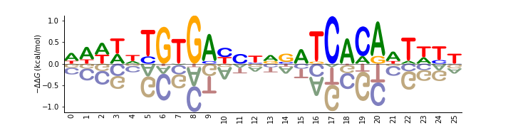
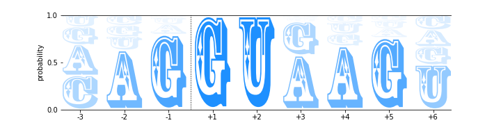
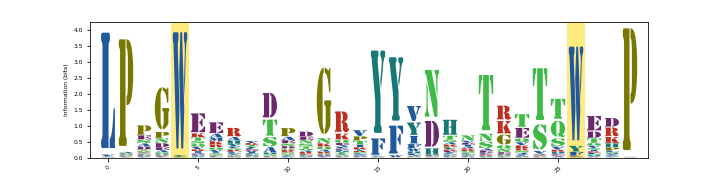
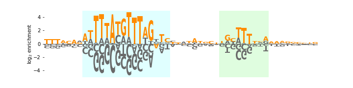
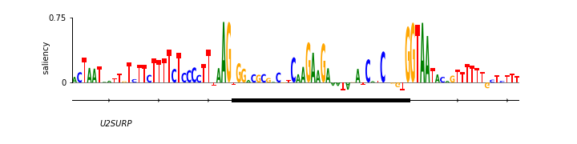

.. _examples:

Examples
========

This section illustrates a variety of logos drawn using logomaker and focuses on customization and styling.
We begin by importing useful packages::

    import numpy as np
    import pandas as pd
    import matplotlib as mpl
    import matplotlib.pyplot as plt

    import logomaker as lm

:math:`\Delta \Delta G` CRP Weight Logo
-----------------------------------------

We begin by loading a crp energy matrix model::

    # load crp dataframe
    crp_df = pd.read_csv('matrices/crp_energy_matrix.txt', delim_whitespace=True, index_col=0)
    crp_df.head()

+-----+---------+--------+--------+---------+
| pos | A       | C      | G      | T       |
+=====+=========+========+========+=========+
| 0   | -0.2975 | 0.2525 | 0.1525 | -0.1075 |
+-----+---------+--------+--------+---------+
| 1   | -0.4700 | 0.4500 | 0.1800 | -0.1600 |
+-----+---------+--------+--------+---------+
| 2   | -0.4475 | 0.5125 | 0.2725 | -0.3375 |
+-----+---------+--------+--------+---------+
| 3   | -0.3675 | 0.4625 | 0.4825 | -0.5775 |
+-----+---------+--------+--------+---------+
| 4   | -0.0975 | 0.2325 | 0.0925 | -0.2275 |
+-----+---------+--------+--------+---------+

This energy matrix was determined by Kinney *et. al.* in [#sortseq2010]_. The following illustration of
the CRP energy logo uses shading and fading of characters below the x-axis This emphasizes characters
with positive values. The shade and fade features are set by using the keyword arguments **shade_below**
and **fade_below** in the constructor for Logo. Additionally, styling options for spines, ticks,
and lables is also demonstrated::

    ### Style CRP panel

    logo = lm.Logo(-crp_df,
                   shade_below=.5,
                   fade_below=.5,
                   font_name='Arial Rounded MT Bold')

    logo.style_spines(visible=False)
    logo.style_spines(spines=['left','bottom'], visible=True)
    logo.ax.set_ylabel("energy ($k_B T$)", labelpad=-1)
    logo.style_xticks(rotation=90, fmt='%d', anchor=0)
    logo.ax.xaxis.set_ticks_position('none')
    logo.ax.set_ylim([-2,2])
    logo.ax.xaxis.set_tick_params(pad=-1)

5' Splice Sites in the Human Genome
-----------------------------------

We now illustrate a probability logo computed from all annotated 5' splices sites in the human genome.
The data are obtained from [#frankish2019]_.

::

    ss_df = pd.read_csv('matrices/ss_prob_matrix.txt', delim_whitespace=True, index_col=0)
    ss_df.head()

+-----+----------+----------+----------+----------+
| pos | A        | C        | G        | U        |
+=====+==========+==========+==========+==========+
| 0   | 0.325785 | 0.359893 | 0.188348 | 0.125974 |
+-----+----------+----------+----------+----------+
| 1   | 0.630292 | 0.109679 | 0.120055 | 0.139974 |
+-----+----------+----------+----------+----------+
| 2   | 0.101195 | 0.027272 | 0.799193 | 0.072340 |
+-----+----------+----------+----------+----------+
| 3   | 0.000000 | 0.000000 | 1.000000 | 0.000000 |
+-----+----------+----------+----------+----------+
| 4   | 0.000000 | 0.000000 | 0.000000 | 1.000000 |
+-----+----------+----------+----------+----------+

::

    logo = lm.Logo(ss_df,
                   width=.8,
                   vpad=.05,
                   fade_probabilities=True,
                   stack_order='small_on_top',
                   color_scheme='dodgerblue',
                   font_name='Rosewood Std')

    logo.ax.set_xticks(range(len(ss_df)))
    logo.ax.set_xticklabels('%+d'%x for x in [-3,-2,-1,1,2,3,4,5,6])
    logo.style_spines(spines=['left', 'right'], visible=False)
    logo.ax.set_yticks([0,.5,1])
    logo.ax.axvline(2.5, color='k', linewidth=1, linestyle=':')
    logo.ax.set_ylabel('probability')

The dashed line indicates intron/exon boundaries. This example shows the use of the keyword argument
**fade_probabilities**; when True, the characters in each stack are assigned an alpha (representing transparency)
value equal to their height. Stacking order of characters is also set by using the keyword argument **stack_order**:
if stack_order =  'small_on_top', glyphs are stacked away from x-axis in order of decreasing absolute value.
**vpad** allows whitespace to be set above and below each character.

Protein Sequence Logo: WW domain
--------------------------------

We now turn to protein sequence logos. We focus on the WW domain [#WWdomain]_, with the eponymous positions of this
domain highlighted. We first load the data

::

    ww_df = pd.read_csv('matrices/ww_info_matrix.txt', delim_whitespace=True, index_col=0)
    ww_df.head()

+-----+----------+----------+----------+----------+----------+----------+----------+
| pos | A        | C        | D        | E        | F        | G        | H        |
+=====+==========+==========+==========+==========+==========+==========+==========+
| 0   | 0.001592 | 0.001592 | 0.001592 | 0.001592 | 0.001592 | 0.001592 | 0.001592 |
+-----+----------+----------+----------+----------+----------+----------+----------+
| 1   | 0.034975 | 0.001399 | 0.001399 | 0.020985 | 0.006995 | 0.012591 | 0.01399  |
+-----+----------+----------+----------+----------+----------+----------+----------+
| 2   | 0.103247 | 0.018391 | 0.090664 | 0.137448 | 0.007098 | 0.020327 | 0.018714 |
+-----+----------+----------+----------+----------+----------+----------+----------+
| 3   | 0.071196 | 0.00063  | 0.127271 | 0.094508 | 0.00441  | 1.462354 | 0.031503 |
+-----+----------+----------+----------+----------+----------+----------+----------+
| 4   | 0.001046 | 0.001046 | 0.001046 | 0.001046 | 0.007325 | 0.001046 | 0.001046 |
+-----+----------+----------+----------+----------+----------+----------+----------+

Note that only part of this dataframe is displayed due to space considerations::

    logo = lm.Logo(ww_df,
                   font_name='Stencil Std',
                   color_scheme='NajafabadiEtAl2017',
                   vpad=.1,
                   width=.8)

    logo.ax.set_ylabel('information (bits)')
    logo.style_xticks(anchor=0, spacing=5, rotation=45)
    logo.highlight_position(p=4, color='yellow', alpha=1)
    logo.highlight_position(p=26, color='yellow', alpha=1)
    logo.ax.set_xlim([-1,len(ww_df)])

We use the method *logo.highlight_position* to highlight the positions of the 2 W's appearing in the above logo. Note that
the color scheme is part of a number of default color dictionaries Logomaker has. The list of available color schemes
can be viewed by calling `logomaker.list_color_schemes()`. The user can choose named colors in matplotlib and also
pass in custom color dictionaries.

Autonomously Replicating Sequence (ARS) Logo
--------------------------------------------

We demonstrate an enrichment logo representing the effects of mutations within the ARS1 replication origin of
S. cerevisiae on replication efficiency. These data (unpublished) were collected by Justin B. Kinney from a mutARS-seq
experiment analogous to the one reported by [#Liachko2013]_. We begin by loading the dataframe::

    # load ars data
    ars_df = pd.read_csv('matrices/ars_weight_matrix.txt', delim_whitespace=True, index_col=0)
    ars_df.reset_index(inplace=True, drop=True)
    ars_df = ars_df.loc[10:59,:]
    ars_df.head()

+-----+-----------+-----------+-----------+-----------+
| pos | A         | C         | G         | T         |
+=====+===========+===========+===========+===========+
| 10  | -0.017399 | -0.358681 | -0.300618 | 0.676698  |
+-----+-----------+-----------+-----------+-----------+
| 11  | -0.061535 | -0.274267 | -0.361952 | 0.697754  |
+-----+-----------+-----------+-----------+-----------+
| 12  | -0.105651 | -0.185962 | -0.440681 | 0.732294  |
+-----+-----------+-----------+-----------+-----------+
| 13  | 0.409042  | -0.132714 | -0.391267 | 0.114938  |
+-----+-----------+-----------+-----------+-----------+
| 14  | -0.034017 | 0.438359  | -0.280204 | -0.124138 |
+-----+-----------+-----------+-----------+-----------+

We then use the function *highlight_position_range* to highlight a range of positions indicating the A (lightcyan),
the B1 (honeydew), B2 (lavenderblush) elements for the ARS.

::

    logo = lm.Logo(ars_df,
                   color_scheme='dimgray',
                   font_name='Luxi Mono')

    logo.style_glyphs_in_sequence(sequence=ars_seq, color='darkorange')
    logo.style_spines(visible=False)
    logo.ax.set_ylim([-4,4])
    logo.ax.set_ylabel('$\log_2$ enrichment', labelpad=0)
    logo.ax.set_yticks([-4,-2,0,2,4])
    logo.ax.set_xticks([])

    logo.highlight_position_range(pmin=7, pmax=22, color='lightcyan')
    logo.highlight_position_range(pmin=33, pmax=40, color='honeydew')
    logo.highlight_position_range(pmin=64, pmax=81, color='lavenderblush')

Saliency Logo
-------------

Saliency maps of deep neural networks accentuate important nucleotides. We adapt a saliency logo from [#Jaganathan]_
representing the importance of nucleotides in the vicinity of U2SUR exon 9, as predicted by a deep neural network
model of splice site selection (reproduced with author permission)::

    # Get exon bounds
    data_df = pd.read_excel('data/Janganathan2018_Fig1D.xlsx')
    exon_indices = data_df['exon']
    indices = data_df.index
    exon_start = min(indices[exon_indices])
    exon_stop = max(indices[exon_indices])

    # make figure
    fig, ax = plt.subplots(figsize=[6.5,1.25])

    # draw logo
    logo = lm.Logo(saliency_df, ax=ax)
    logo.style_spines(visible=False)
    logo.style_spines(spines=['left'],visible=True,bounds=[0,.75])
    ax.set_yticks([0,.75])
    ax.set_yticklabels(['0','0.75'])
    ax.set_ylim([-.5,.75])
    ax.set_xticks([])
    ax.set_ylabel('           saliency', labelpad=-2)

    # Draw gene
    y = -.2
    ax.axhline(y, color='k', linewidth=1)
    xs = np.arange(-3,len(saliency_df),10)
    ys = y*np.ones(len(xs))
    ax.plot(xs,ys,marker='4', linewidth=0, markersize=5, color='k')

    # Draw gene name
    ax.text(5,-.5,'U2SURP', fontstyle='italic')

    # Draw exon
    ax.plot([exon_start, exon_stop],[y,y], color='k', linewidth=5)

This example demonstrates how Logomaker is able to leverage the entire machinery of matplotlib, thus
allowing the user to customize their logos however much they want.

References
~~~~~~~~~~

.. [#sortseq2010] Kinney JB, Murugan A, Callan CG, Cox EC. 2010. `Using deep sequencing to characterize the biophysical mechanism of a transcriptional regulatory sequence`. Proc Natl Acad Sci USA 107:9158-9163 :download:`PDF <sortseq2010.pdf>`.

.. [#frankish2019] Frankish, A. et al. (2019). `GENCODE reference annotation for the human and mouse genomes.` Nucl Acids Res, 47(D1), D766–D773.

.. [#WWdomain] Fowler, D. M. et al. `High-resolution mapping of protein sequence-function relationships.` Nature Methods 7, 741–746 (2010).

.. [#Liachko2013] Liachko, I. et al. (2013). `High-resolution mapping, characterization, and optimization of autonomously replicating sequences in yeast.` Genome Res, 23(4), 698-704.

.. [#Jaganathan] Jaganathan, K. et al. (2019). `Predicting Splicing from Primary Sequence with Deep Learning.` Cell, 176(3), 535-548.e24.