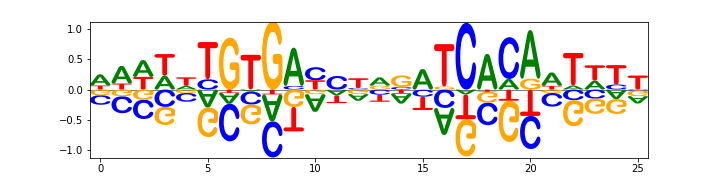

=============================================
Logomaker: beautiful sequence logos in Python
=============================================

*Written by Ammar Tareen and Justin B. Kinney.*

Logomaker is a Python package for generating publication-quality sequence logos.
Logomaker can generate both standard and highly customized logos illustrating the properties of DNA, RNA, or protein sequences.
Logos are rendered as vector graphics embedded within native matplotlib Axes objects, making them easy to style and incorporate into multi-panel figures.
The Installation, Quick Start, Tutorial, and Examples sections below are provided to help users quickly get Logomaker working for their own research needs.
For more information about Logomaker, please see our preprint [#Tareen2019]_.

.. toctree::
   :maxdepth: 2
   :caption: Contents:

Installation
--------------

Logomaker has minimal dependencies, is compatible with both Python 2.7
and Python 3.6, and can be readily installed from
`PyPI <https://pypi.python.org/pypi/logomaker>`_ using the pip package
manager::

    pip install logomaker

The code for logomaker is available on
`GitHub <https://github.com/jbkinney/logomaker>`_ under an MIT
open source license.

Quick Start
-----------

For a quick demo of Logomaker, execute the following within Python::

   import logomaker
   logomaker.demo('fig1b')

This command will generate a sequence logo representing the
DNA binding specificity of CRP, a major transcription factor in *Escherichia coli*:

This command will also print out the code used to generate the logo.
We note that the logo shown here is from Figure 1B of [#Tareen2019]_, and that the other logos in Figure 1 can be generated in a similar manner.

..
    This command will also print out the code used to generate the logo.
    Alternatively, the following code will generate a customized logo representing information content within WW protein domains::

       import logomaker
       logomaker.demo('fig1d')

    .. image:: _static/WW_information_logo.png

Tutorial
--------

.. toctree::
   :maxdepth: 3

   tutorial

Examples
--------

.. toctree::
   :maxdepth: 2

   examples

Implementation
--------------

.. toctree::
   :maxdepth: 2

   Logo
   Glyph
   matrix
   validate
   examples_src

Reference
----------

.. [#Tareen2019] Tareen A, Kinney JB (2019) `Logomaker: beautiful sequence logos in Python. <https://biorxiv.org>`_ *bioRxiv doi:XXXX/XXXX.

Contact
-------

For technical assistance or to report bugs, please
contact `Ammar Tareen <tareen@cshl.edu>`_.

For more general correspondence, please
contact `Justin Kinney <jkinney@cshl.edu>`_.

Other links:

- `Kinney Lab <http://kinneylab.labsites.cshl.edu/>`_
- `Simons Center for Quantitative Biology <https://www.cshl.edu/research/quantitative-biology/>`_
- `Cold Spring Harbor Laboratory <https://www.cshl.edu/>`_
