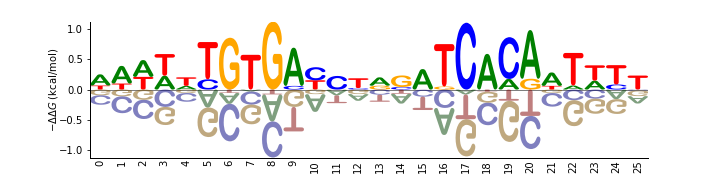

=============================================
Logomaker: beautiful sequence logos in Python
=============================================

Logomaker is a Python package for generating publication-quality sequence logos.
Logomaker can generate both standard and highly customized logos illustrating the properties of DNA, RNA, or protein sequences.
Logos are rendered as vector graphics embedded within native matplotlib Axes objects, making them easy to style and incorporate into multi-panel figures.
The :ref:`installation`, :ref:`quickstart`, :ref:`examples`, and :ref:`tutorial` sections below are provided to help users quickly get Logomaker working for their own research needs.
For more information about Logomaker, please see Tareen and Kinney (2019) [#Tareen2019]_.

.. toctree::
   :maxdepth: 2
   :caption: Contents:

.. _installation:

Installation
--------------

Logomaker has minimal dependencies and is compatible with both Python 2.7 and Python 3.6.
The code for Logomaker is available on `GitHub <https://github.com/jbkinney/logomaker>`_ under an MIT open source license.
Logomaker can be installed from `PyPI <https://pypi.org/project/logomaker/>`_ using the ``pip`` package manager by executing the following at the commandline: ::

    pip install logomaker

.. _quickstart:

Quick Start
-----------

For a quick demonstration of Logomaker, execute the following within Python::

   import logomaker
   logomaker.demo('fig1b')

This command will generate a sequence logo representing the
DNA binding specificity of CRP, a major transcription factor in *Escherichia coli*:

This command will also print out the code used to generate the logo.
We note that the logo shown here is from Figure 1B of Tareen and Kinney (2019) [#Tareen2019]_, and that the other logos in Figure 1 can be generated in a similar manner.

Resources
---------

.. toctree::
    :maxdepth: 2

    examples
    tutorial
    implementation

Reference
----------

.. [#Tareen2019] Tareen A, Kinney JB (2019) Logomaker: beautiful sequence logos in Python. `bioRxiv doi:10.1101/635029. <https://www.biorxiv.org/content/10.1101/635029v1>`_

Contact
-------

For technical assistance or to report bugs, please contact Ammar Tareen (`Email: tareen@cshl.edu <tareen@cshl.edu>`_, `Twitter: @AmmarTareen1 <https://twitter.com/AmmarTareen1>`_) . For more general correspondence, please contact Justin Kinney (`Email: jkinney@cshl.edu <jkinney@cshl.edu>`_, `Twitter: @jbkinney <https://twitter.com/jbkinney>`_).

Links
-----

- `Logomaker preprint on bioRxiv <https://www.biorxiv.org/content/10.1101/635029v1>`_
- `Logomaker on GitHub <https://github.com/jbkinney/logomaker>`_
- `Logomaker on PyPI <https://pypi.org/project/logomaker/>`_
- `Kinney Lab <http://kinneylab.labsites.cshl.edu/>`_
- `Cold Spring Harbor Laboratory <https://www.cshl.edu/>`_
