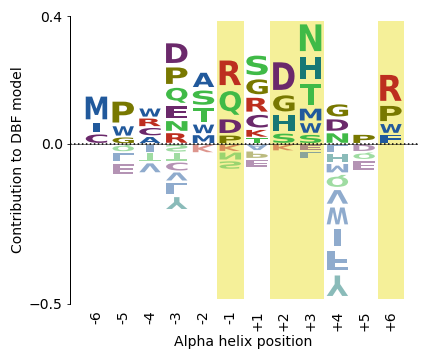
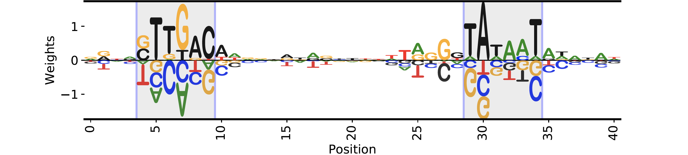
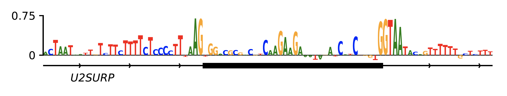

=======================================================================
Logomaker: a Python API for creating publication quality sequence logos
=======================================================================

*Written by Ammar Tareen, and Justin B. Kinney.*

.. raw:: html

    <h1>Under Active Development</h1>

Logomaker is a Python application programming interface (API) for generating publication-quality sequence logos.
Sequence logos are a popular way of representing a variety of sequence-function relationships.
Currently available Python applications for making sequence logos are optimized only for specific
experiments, and thus are limited in their usage.Logomaker can generate
logos from a variety of data including multiple sequence alignments, enrichment data from massively
parallel reporter assays (MPRAs) and deep mutational scanning (DMS) experiments. Logomaker logos
are generated as native matplotlib axes objects that are amenable to subsequent customization and
incorporation into multi-panel figures.

.. toctree::
   :maxdepth: 2
   :caption: Contents:

Examples
--------

RNAP Enrichment
===============

Saliency
========

Installation
------------

logomaker can be installed from
`PyPI <https://pypi.python.org/pypi/logomaker>`_ using the pip package
manager. At the command line::

    pip install logomaker

The code for logomaker is open source and available on
`GitHub <https://github.com/jbkinney/logomaker>`_.

Matrix Definitions
------------------

A matrix is defined by a set of textual characters, a set of numerical positions, and a numerical
quantity for every character-position pair. In what follows, we use the symbol :math:`i` to represent possible
positions, and the symbol :math:`c` (or :math:`c'`) to represent possible characters.

Within Python, each matrix is represented as a pandas data frame in which rows are indexed by positions
and columns are named using the character each represents. Logomaker can also read and write matrices as
text files. Any set of numerical positions can be used, as can any non-whitespace characters. Logomaker is
agnostic to the set of characters used.

Logos
=====

Any matrix can be represented as a logo in a straight-forward manner. Given a matrix,
a corresponding logo is drawn by stacking  the unique characters on top of one another
at each specified position. Each character at each position is drawn with a height given
by the value of the corresponding matrix element.

Characters with positive heights are stacked on top of one another starting from a baseline value of 0,
whereas characters with heights less than zero are stacked below one another starting from the baseline.
Logomaker provides the option of flipping characters with negative height upside down and/or darkening
the color with which such characters are drawn.

Built-in matrix and logo types
==============================

Although Logomaker will draw logos corresponding to any user-specified matrix, additional support
is provided for matrices of five specific types: counts matrix, probability matrix, enrichment matrix,
saliency matrix, and information matrix. Each matrix type directly or indirectly represents the marginal
statistics of a sequence alignment, and Logomaker can generate any one of these types of matrices from a
sequence alignment supplied by the user. Methods to interconvert matrices of these types are also provided.
Moreover, each of these five matrix types comes with its own logo style. These matrices and their corresponding
logos are described in detail below.

Counts matrix
=============

A counts matrix represent the number of occurrences of each character at each position within a sequence
alignment (although the user can choose to exclude certain characters, e.g., '-' character representing gaps).
Specifically, a counts matrix has entries :math:`n_{ic}` that represent the number of occurrences of character
:math:`c` at position :math:`i`. These :math:`n_{ic}` values are all required to be greater or equal to zero. Counts logos are
assigned character heights corresponding to these :math:`n_{ci}` values. The y axis of such logos is labeled 'counts'
and extends from 0 to :math:`N`, where :math:`N` is the number of sequences in the alignment. Note that, Because certain
characters might be excluded when computing :math:`n_{ic}` from an alignment, it is possible to have
:math:`\sum_c n_{ic} < N` at some positions.

Probability matrix
==================

A probability matrix represents the probability of observing each possible character at each possible position
within a certain type of sequence. Probability matrix elements are denoted by :math:`p_{ic}` and can be estimated
from a counts matrix via

:math:`p_{ic} = \frac{n_{ic} + \lambda}{\sum_{c'} n_{ic'} + C \lambda}`

where :math:`C` is the number of possible characters and :math:`\lambda` is a user-defined pseudocount.
A probability logo has heights given by these :math:`p_{ci}` values. The y axis extends from 0 to 1
and is labeled 'probability'.

Enrichment or Weight matrix
===========================

An enrichment matrix represent the relative likelihood of observing each character at each position
relative to some user-specified "background" model. Such matrices are sometimes referred to as position weight
matrices (PWMs) or position-specific scoring matrices (PSSMs). The elements :math:`w_{ic}` of an
enrichment matrix can be computed from a probability matrix (elements :math:`p_{ic}`) and a
background matrix (also a probability matrix but denoted :math:`b_{ic}`) using the formula

:math:`w_{ic} = \log_2 \frac{p_{ic}}{b_{ic}}`

This equation can be inverted to give :math:`p_{ic}`:

:math:`p_{ic} = \frac{b_{ic} 2^{w_{ic}}}{ \sum_{c'} b_{ic'} 2^{w_{ic'}} }`

where the denominator is included to explicitly enforce the the requirement that :math:`\sum_c p_{ic} = 1` at
every :math:`i`. Note that :math:`b_{ic}` will often not depend on $i$, but it does vary with :math:`i` in some cases, such as
computation of enrichment scores in deep mutational scanning experiments. Enrichment logos have heights given
by the :math:`w_{ci}` values, which can be either positive or negative. The y-axis is labeled ':math:`\log_2` enrichment'
by default.

Information matrix
==================

Information logos were described in the original 1990 paper of Schneider and Stephens cite{Schneider},
and remain the most popular type of sequence logo. The entries :math:`I_{ic}`in the corresponding information matrices
are given by

:math:`I_{ci} = p_{ci} I_i,~~~I_i = \sum_c p_{ci} \log_2 \frac{p_{ci}}{b_{ci}}`

The position-dependent (but not character dependent) quantity :math:`I_i` is called the "information content"
of site :math:`i`, and the sum of these quantities, :math:`I = \sum_{i} I_i`, is the information content
of the entire matrix. These information values :math`I_{ic}`  are nonnegative and are said to be in units of
'bits' due to the use of :math:`\log_2` in Eq. ref{eq:prob_to_info}. A corresponding information logo is drawn
using these :math:`I_{ic}` values as character heights, as well as a y-axis labeled  'information (bits)'.

.. :math:`g_{ic} = \tilde{g}_{ic} - \frac{1}{C} \sum_{c'} \tilde{g}_{ic'} ,~~~\tilde{g}_{ic} = -\frac{1}{\alpha} \log \frac{p_{ic}}{b_{ic}}`

.. :math:`p_{ci} = \frac{b_{ci} \exp [ - \alpha g_{ci} ] }{\sum_{c'} b_{c'i} \exp[ - \alpha g_{c'i} ] }`

Tutorials
---------

.. toctree::
   :maxdepth: 2

   tutorials

Classes and Functions Documentation
-----------------------------------

.. toctree::
   :maxdepth: 2

   Logo
   Glyph
   matrix
   validate

Contact
-------

For technical assistance or to report bugs, please
contact `Ammar Tareen <tareen@cshl.edu>`_.

For more general correspondence, please
contact `Justin Kinney <jkinney@cshl.edu>`_.

Other links:

- `Kinney Lab <http://kinneylab.labsites.cshl.edu/>`_
- `Simons Center for Quantitative Biology <https://www.cshl.edu/research/quantitative-biology/>`_
- `Cold Spring Harbor Laboratory <https://www.cshl.edu/>`_
