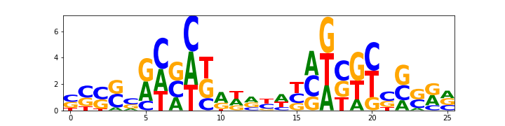
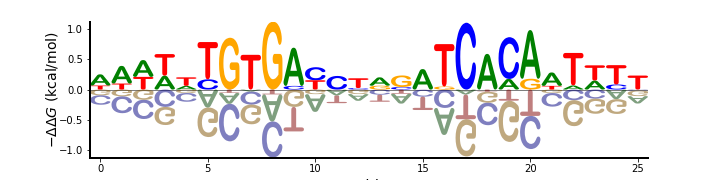
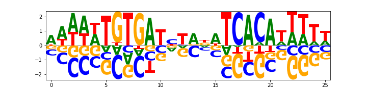
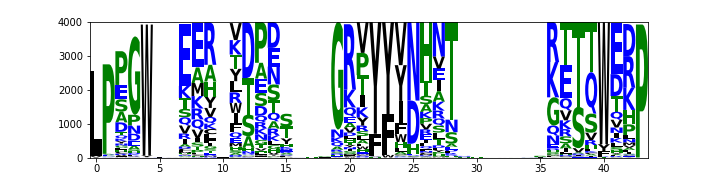
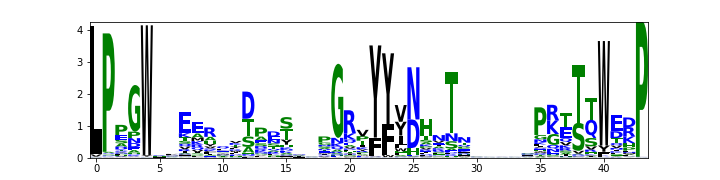
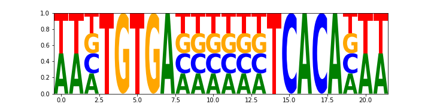
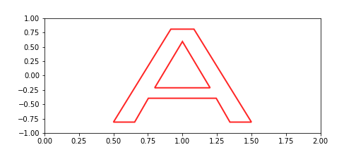
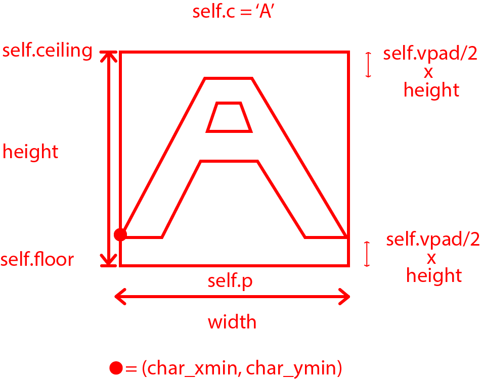
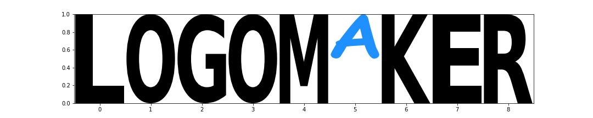

Tutorial
========

This tutorial provides a walk through of the Logomaker functionality. Code snippets snippets as wells as complete
jupyter notebooks are provided at the end of each section.

Simple Example
---------------

To get started with Logomaker, we begin by importing three useful python packages and Logomaker::

    # useful imports
    import numpy as np
    import pandas as pd
    import matplotlib.pyplot as plt
    import logomaker as lm

    # logomaker method to load example matrices
    crp_df = -lm.get_example_matrix('crp_energy_matrix')
    crp_df.head()

+---+------+------+------+------+
|   | A    | C    | G    |  T   |
+===+======+======+======+======+
| 0 | 0.00 | 0.55 | 0.45 | 0.19 |
+---+------+------+------+------+
| 1 | 0.00 | 0.92 | 0.65 | 0.31 |
+---+------+------+------+------+
| 2 | 0.00 | 0.96 | 0.72 | 0.11 |
+---+------+------+------+------+
| 3 | 0.21 | 1.04 | 1.06 | 0.00 |
+---+------+------+------+------+
| 4 | 0.13 | 0.46 | 0.32 | 0.00 |
+---+------+------+------+------+

These data correspond to an energy matrix for the transcription factor CRP, and are from from [#sortseq2010]_. Note
that users can easily load data using the Logomaker method :ref:`get_example_matrix`.
To draw a logo, logomaker expects a pandas dataframe as input to its :ref:`Logo` class. The columns of this dataframe
represent characters, rows represent positions, and values represent character heights conveying some type of
information about their biological importance. Thus, we draw the logo as follows::

    logo = lm.Logo(crp_df)

Basic Styling
-------------

This section introduces basic styling options logomaker provides, applied to the CRP logo from the previous section.
We still use the :ref:`Logo` class (specifically, its constructor) to draw the logo, however we now set a few extra
for styling::

    # some basic styling for the crp logo
    logo = lm.Logo(df=crp_df,
                          center_values=True,
                          font_name='Arial Rounded MT Bold',
                          fade_below=0.5,
                          shade_below=0.5)

    # style logo spines
    logo.style_spines(visible=False)
    logo.style_spines(spines=['left','bottom'], visible=True, linewidth=2)

    # set axes labels
    logo.ax.set_xlabel('Position',fontsize=14)
    logo.ax.set_ylabel("$-\Delta \Delta G$ (kcal/mol)", labelpad=-1,fontsize=14)

Note also that we have used the Logo class function `style_spines` for customizing the spines of the counts logo.
Additionally, the `ax` object available to the variable `logo` in the above snippet is a
`Matplotlib Axes object <https://matplotlib.org/api/axes_api.html>`_, which allows the user to leverage the
functionality of matplotlib for further customization. The resulting logo looks like

Matrix from alignment
---------------------

Logomaker provides functionality to convert multiple sequence alignments to valid dataframes that can subsequently
be drawn. Note that detailed information about matrix types can be found in the section :ref:`matrix_types`.
Consider the following multiple sequence alignment (in fasta format) representing CRP binding sites
on the E-Coli genome (from [#crpsitesfa]_).

::

    >0	caiFp	-41.5
    ATAAGCAGGATTTAGCTCACACTTAT
    >1	caiTp	-41.5
    AAAAATGTGATACCAATCACAGAATA
    >2	fixAp	-126.5
    ATATTGGTGATCCATAAAACAATATT
    ...

These data can be obtained by calling the logomaker method :ref:`open_example_datafile` as follows::

    crp_sites = lm.open_example_datafile('crp_sites.fa')
    with open(crp_sites.name, 'r') as f:
        raw_seqs = f.readlines()
    raw_seqs[:20]

We can remove the non-sequence lines to obtain just the raw sequences::

    # extract binding site sequences from FASTA lines
    seqs = [seq.strip() for seq in raw_seqs if ('#' not in seq) and ('>') not in seq]
    # preview sequences
    seqs[:5]

    ATAAGCAGGATTTAGCTCACACTTAT
    AAAAATGTGATACCAATCACAGAATA
    ATATTGGTGATCCATAAAACAATATT
    ATATTGGTGAGGAACTTAACAATATT
    GATTATTTGCACGGCGTCACACTTTG
    ...

Once in this form, we can use logomaker's method :ref:`alignment_to_matrix` to generate a
counts dataframe, which can be input to Logomaker.

::

    counts_mat = lm.alignment_to_matrix(seqs[10:])
    counts_mat.head()

The resulting pandas dataframe looks like:

+-----+-------+-------+------+------+
| pos | A     | C     | G    | T    |
+=====+=======+=======+======+======+
| 0   | 133.0 | 65.0  | 72.0 | 88.0 |
+-----+-------+-------+------+------+
| 1   | 147.0 | 46.0  | 58.0 | 107.0|
+-----+-------+-------+------+------+
| 2   | 166.0 | 26.0  | 38.0 | 128.0|
+-----+-------+-------+------+------+
| 3   | 164.0 | 28.0  | 43.0 | 123.0|
+-----+-------+-------+------+------+
| 4   | 133.0 | 45.0  | 47.0 | 133.0|
+-----+-------+-------+------+------+

Entering the counts matrix into The Logo class draws a counts logo::

    lm.Logo(counts_mat)

.. image:: _static/tutorial_images/counts_logo.png

.. role::  raw-html(raw)
    :format: html

Transform Matrix
----------------

Logomaker supports multiple different logo types and allows the user to seamlessly transform
from one type of logo to another via the method :ref:`transform_matrix`. The transformations that
can be performed are listed below:

1. **Center values**:
    Subtracts the mean from each row in df. This is common for weight
    matrices or energy matrices. To do this, set center_values=True.

2. **Normalize values**:
    Divides each row by the sum of the row. This is needed for probability
    matrices. To do this, set normalize_values=True.

3. **From** :raw-html:`&rarr;` **To transformations**:
    Transforms from one type of matrix (e.g. 'counts') to another type
    of matrix (e.g. 'information'). To do this, set from_type and to_type
    arguments.

    +----------------+---+---------------+---------+---+----------------+
    | from_type      | = | ‘counts’      | to_type | = | ‘probability': |
    +----------------+---+---------------+---------+---+----------------+
    | from_type      | = | ‘probability' | to_type | = | ‘weight'       |
    +----------------+---+---------------+---------+---+----------------+
    | from_type      | = | ‘weight'      | to_type | = | ‘weight'       |
    +----------------+---+---------------+---------+---+----------------+
    | from_type      | = | ‘probability' | to_type | = | ‘information'  |
    +----------------+---+---------------+---------+---+----------------+
    | from_type      | = | ‘information' | to_type | = | ‘probability'  |
    +----------------+---+---------------+---------+---+----------------+

Using these five 1-step transformations, 2-step transformations
are also enabled, e.g., from_type=‘counts' :raw-html:`&rarr;` to_type=‘information'. In the following, we show
two examples of the transform matrix functionality, beginning with the CRP logo::

    # Counts matrix -> Weight matrix
    weight_mat = lm.transform_matrix(counts_mat,
                                            from_type='counts',
                                            to_type='weight')

    lm.Logo(weight_mat, center_values=True,font_name='Arial Rounded MT Bold')

For our second example, we load the WW domain protein alignment (from [#WWdomain]_), by using the function
:ref:`open_example_datafile`::

    # load ww alignment
    with logomaker.open_example_datafile('ww_sequences.fa', print_description=False) as f:
        lines = f.readlines()

    # extract ww domain sequences
    seqs = [seq.strip().upper() for seq in lines if ('#' not in seq) and ('>') not in seq]

    # preview sequences
    seqs[:5]

    LPPQW..TEA.VDVDT...GKFYFVHVET.......KETRWERP
    --PGW..TAT.VDPAS...GRTYYYHAAT.......GETRWEPP
    LPSGW..VEQ.TDPSS...GRPYYYHNAS.......NLTQWERP
    LPAGW..VAA.NDPSS...GRTYYYHAES.......GVTSWNPP
    LPNGW..QEL.VDPSS...GSTYYYNEVN.......GTTSWDRP
    LPEGW..VEL.VHESS...GKTYYFHAED.......NVTSWEQP

We load the alignment as a count matrix, again by using :ref:`alignment_to_matrix`::

    # create counts matrix
    ww_counts_df = lm.alignment_to_matrix(sequences=seqs, to_type='counts', characters_to_ignore='.-X')

    # show full ww counts
    lm.Logo(ww_counts_df)

and then transform it to an information matrix::

    # transform to information matrix
    ww_info_df = lm.transform_matrix(ww_counts_df, from_type='counts', to_type='information')

    # show logo
    logo = lm.Logo(ww_info_df)

    # highlight position of 2 W's
    logo.highlight_position(p=4, color='gold', alpha=.5)
    logo.highlight_position(p=40, color='gold', alpha=.5)

Here, we have also used the function `highlight_position` to demarcate the two W's the logo:

Sequence to Matrix
------------------

Logomaker provides functionality to turn sequences into matrices. The following two methods illustrate these
features

IUPAC motifs
~~~~~~~~~~~~

Given an iupac sequence, :ref:`sequence_to_matrix` will generate a corresponding iupac matrix which can
be readily visualized::

    # Create CRP logo from IUPAC motif
    iupac_seq = 'WWNTGTGANNNNNNTCACANWW'
    iupac_mat = lm.sequence_to_matrix(iupac_seq,  is_iupac=True)
    iupac_mat.head()

+-----+-------+-------+------+------+
| pos | A     | C     | G    | T    |
+=====+=======+=======+======+======+
| 0   | 0.50  | 0.00  | 0.00 | 0.50 |
+-----+-------+-------+------+------+
| 1   | 0.50  | 0.00  | 0.00 | 0.25 |
+-----+-------+-------+------+------+
| 2   | 0.25  | 0.25  | 0.25 | 0.25 |
+-----+-------+-------+------+------+
| 3   | 0.00  | 0.00  | 0.00 | 1.00 |
+-----+-------+-------+------+------+
| 4   | 0.00  | 0.00  | 1.00 | 0.00 |
+-----+-------+-------+------+------+

::

    logo = logomaker.Logo(iupac_mat)

Saliency to matrix
~~~~~~~~~~~~~~~~~~
The :ref:`saliency_to_matrix` function takes a sequence string and an array of values values and outputs a
values dataframe. The returned dataframe is a L by C matrix where C is
the number ofcharacters and L is sequence length.  If matrix is denoted as
S, i indexes positions and c indexes characters, then :math:`S_{ic}` will be non-zero
(equal to the value in the values array at position p) only if character c
occurs at position p in sequence. All other elements of S are zero. As an example we use saliency data
from [#Jaganathan]_::

    # useful python library for working with matrices and dataframes
    import pandas as pd

    # load saliency data
    with lm.open_example_datafile('nn_saliency_values.txt') as f:
        saliency_data_df = pd.read_csv(f, comment='#', sep='\t')

    # preview dataframe
    saliency_data_df.head()

+----------------------+
|character |   value   |
+======================+
| G        | -0.001725 |
+----------------------+
| G        |  0.033557 |
+----------------------+
| G        |  0.030026 |
+----------------------+
| G        |  0.012748 |
+----------------------+
| G        |  0.000337 |
+----------------------+

Just as before, we now re-use :ref:`saliency_to_matrix`::

    # create saliency matrix
    saliency_mat_df = lm.saliency_to_matrix(seq=saliency_data_df['character'],
                                                   values=saliency_data_df['value'])

    # show logo
    lm.Logo(saliency_mat_df)

.. image:: _static/tutorial_images/saliency_logo.png

Advanced Styling
----------------

This section introduces some advanced styling functionality the Logomaker offers.

Glyphs
------

Logomaker uses the :ref:`Glyph` class to render individual glyphs; this class also allows the user to customize
each glyph according to their needs. As an example, the following figure shows how to raw a single character::

    from logomaker import Glyph

    fig, ax = plt.subplots(figsize=[7,3])

    # set bounding box
    ax.set_xlim([0,2])
    ax.set_ylim([-1,1])

    Glyph(c='A',
          p=1,
          width= 1.0,
          alpha=.85,
          ax = ax,
          vpad = 0.1,
          font_weight=0,
          ceiling=0.9,
          floor=-0.9,
          color='white',
          flip=False,
          mirror=True,
          edgecolor='red',
          edgewidth=2)

The coordinate system that the glyph class uses is introduced in the figure
below:

Logomaker also allows the user to use the Glyph class to draw logos directly from input strings. The user
can subsequently modify individual glyphs in the rendered logo::

    fig, ax = plt.subplots(figsize=[15,3])

    # Style axes
    s = 'LOGOMAKER'
    ax.set_ylim([0,1])
    ax.set_xlim([-.5,len(s)-.5])
    #ax.axis('off')

    # Create a list of glyphs
    glyphs = []
    for p, c in enumerate(s):
        g = Glyph(c=c, p=p,ax=ax, draw_now=False, ceiling=1,floor=0,color='black')
        glyphs.append(g)

    # Modify a single glyph
    g = glyphs[5]
    g.color='dodgerblue'
    g.floor=.5
    g.font_name='Comic Sans MS'
    g.flip=False

    # Draw all glyphs
    for g in glyphs:
        g.draw()

.. _matrix_types:

Matrix Types
============

This section provides defnitions of matrix types supported by Logomaker. A matrix is defined by a set of textual
characters, a set of numerical positions, and a numerical quantity for every character-position pair. In what
follows, we use the symbol :math:`i` to represent possible positions, and the symbol :math:`c` (or :math:`c'`)
to represent possible characters.

In Logomaker, each matrix is represented as a pandas data frame in which rows are indexed by positions
and columns are named using the character each represents. Any set of numerical positions can be used,
as can any non-whitespace characters. Logomaker is agnostic to the set of characters used.

Logos
-----

Any matrix can be represented as a logo in a straight-forward manner. Given a matrix,
a corresponding logo is drawn by stacking  the unique characters on top of one another
at each specified position. Each character at each position is drawn with a height given
by the value of the corresponding matrix element.

Characters with positive heights are stacked on top of one another starting from a baseline value of 0,
whereas characters with heights less than zero are stacked below one another starting from the baseline.
Logomaker provides the option of flipping characters with negative height upside down and/or darkening
the color with which such characters are drawn.

Built-in matrix and logo types
------------------------------

Although Logomaker will draw logos corresponding to any user-specified matrix, additional support
is provided for matrices of five specific types: counts matrix, probability matrix, weight matrix,
saliency matrix, and information matrix. Apart from saliency, each matrix type directly or indirectly
represents the marginal statistics of a sequence alignment, and Logomaker can generate any
one of these types of matrices from a sequence alignment supplied by the user. These matrices and their corresponding
logos are described in detail below.

Counts matrix
-------------

A counts matrix represent the number of occurrences of each character at each position within a sequence
alignment (although the user can choose to exclude certain characters, e.g., '-' character representing gaps).
Specifically, a counts matrix has entries :math:`n_{ic}` that represent the number of occurrences of character
:math:`c` at position :math:`i`. These :math:`n_{ic}` values are all required to be greater or equal to zero. Counts logos are
assigned character heights corresponding to these :math:`n_{ic}` values. The y axis of such logos extends from 0 to
:math:`N`, where :math:`N` is the number of sequences in the alignment. Note that, Because certain
characters might be excluded when computing :math:`n_{ic}` from an alignment, it is possible to have
:math:`\sum_c n_{ic} < N` at some positions.

Probability matrix
------------------

A probability matrix represents the probability of observing each possible character at each possible position
within a certain type of sequence. Probability matrix elements are denoted by :math:`p_{ic}` and can be estimated
from a counts matrix via

:math:`p_{ic} = \frac{n_{ic} + \lambda}{\sum_{c'} n_{ic'} + C \lambda}`

where :math:`C` is the number of possible characters and :math:`\lambda` is a user-defined pseudocount.
A probability logo has heights given by these :math:`p_{ic}` values. The y axis extends from 0 to 1.

Weight matrix
-------------

A weight matrix draws characters with positive values above the x-axis and draw characters with negative
values below it. A weight matrix can be used to represent an enrichment logo, where the relative likelihood
of observing each character at each position is relative to some user-specified "background" model.
Such matrices are sometimes referred to as position weight matrices (PWMs) or position-specific
scoring matrices (PSSMs). The elements :math:`w_{ic}` of an enrichment matrix can be computed from a
probability matrix (elements :math:`p_{ic}`) and a background matrix
(also a probability matrix but denoted :math:`b_{ic}`) using the formula

:math:`w_{ic} = \log_2 \frac{p_{ic}}{b_{ic}}`

This equation can be inverted to give :math:`p_{ic}`:

:math:`p_{ic} = \frac{b_{ic} 2^{w_{ic}}}{ \sum_{c'} b_{ic'} 2^{w_{ic'}} }`

where the denominator is included to explicitly enforce the the requirement that :math:`\sum_c p_{ic} = 1` at
every :math:`i`. Note that :math:`b_{ic}` will often not depend on :math:`i`, but it does vary with :math:`i` in some cases, such as
computation of enrichment scores in deep mutational scanning experiments. Enrichment logos have heights given
by the :math:`w_{ic}` values, which can be either positive or negative.

Information matrix
------------------

Information logos were described in the original 1990 paper of Schneider and Stephens [#weblogo1990]_,
and remain the most popular type of sequence logo. The entries :math:`I_{ic}` in the corresponding information matrices
are given by

:math:`I_{ic} = p_{ci} I_i,~~~I_i = \sum_c p_{ci} \log_2 \frac{p_{ci}}{b_{ci}}`

The position-dependent (but not character dependent) quantity :math:`I_i` is called the "information content"
of site :math:`i`, and the sum of these quantities, :math:`I = \sum_{i} I_i`, is the information content
of the entire matrix. These information values :math:`I_{ic}`  are nonnegative and are said to be in units of
'bits' due to the use of :math:`\log_2`. A corresponding information logo is drawn
using these :math:`I_{ic}` values as character heights.

.. :math:`g_{ic} = \tilde{g}_{ic} - \frac{1}{C} \sum_{c'} \tilde{g}_{ic'} ,~~~\tilde{g}_{ic} = -\frac{1}{\alpha} \log \frac{p_{ic}}{b_{ic}}`

.. :math:`p_{ci} = \frac{b_{ci} \exp [ - \alpha g_{ci} ] }{\sum_{c'} b_{c'i} \exp[ - \alpha g_{c'i} ] }`

Jupyter notebook Downloads
==========================

-   :download:`Logoamker Tutorial Simple <Logomaker_Tutorial_Simple.ipynb>`
-   :download:`Logoamker Tutorial Glyphs <Logomaker_Tutorial_Glyphs.ipynb>`

References
~~~~~~~~~~

.. [#sortseq2010] Kinney, J. B. et al. (2010). `Using deep sequencing to characterize the biophysical mechanism of a transcriptional regulatory sequence.` Proc Natl Acad Sci USA, 107(20), 9158-9163.

.. [#crpsitesfa] Salgado H, et al. (2013) `RegulonDB v8.0: omics data sets, evolutionary conservation, regulatory phrases, cross-validated gold standards and more.` Nucl Acids Res. 41 (Database issue):D203-13.

.. [#WWdomain] Finn RD et al. (2014) `Pfam: the protein families database.` Nucl Acids Res. 42(Database issue):D222–30.

.. [#Jaganathan] Jaganathan K et al. (2019) `Predicting Splicing from Primary Sequence with Deep Learning.` Cell. 176(3):535–548.e24.

.. [#weblogo1990] Schneider,T.D. and Stephens,R.M. (1990) Nucleic Acids Res., 18, 6097-6100.