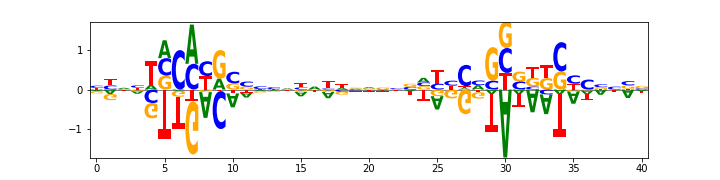
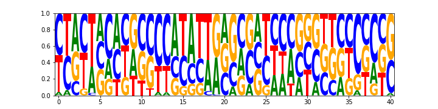

Tutorial
========

This tutorial provides a walk through of the Logomaker functionality. Code snippets are provided for
easy reproduction. Note that detailed information and mathematical definitions of various types of logos can be
found in :ref:`matrix_definitions`. We begin by importing three useful python packages and Logomaker::

    import numpy as np
    import pandas as pd
    import matplotlib.pyplot as plt

    import logomaker

Alignment to Matrix
-------------------

The input to Logomaker's Logo class is a pandas data frame in which columns represent
characters, rows represent positions, and values represent character heights. Multiple sequence alignments
are commonly found in fasta format.

::

    >0	caiFp	-41.5
    ATAAGCAGGATTTAGCTCACACTTAT
    >1	caiTp	-41.5
    AAAAATGTGATACCAATCACAGAATA
    >2	fixAp	-126.5
    ATATTGGTGATCCATAAAACAATATT
    ...

The data used in this example describe mutagenized DNA sequences corresponding to CRP binding sites.
We can remove the non-sequence lines to obtain just the raw sequences::

    with open('crp_sites.fasta','r') as f:
        seqs = [l.strip() for l in f.readlines() if '>' not in l and len(l.strip())>0]

    ATAAGCAGGATTTAGCTCACACTTAT
    AAAAATGTGATACCAATCACAGAATA
    ATATTGGTGATCCATAAAACAATATT
    ...

Once in this form, we can use logomaker's method :ref:`alignment_to_matrix` to generate a
counts dataframe, which now be input to logomaker.

::

    counts_mat = logomaker.alignment_to_matrix(seqs)
    counts_mat.head()

The resulting pandas dataframe looks like:

+-----+-------+-------+------+------+
| pos | A     | C     | G    | T    |
+=====+=======+=======+======+======+
| 0   | 133.0 | 65.0  | 72.0 | 88.0 |
+-----+-------+-------+------+------+
| 1   | 147.0 | 46.0  | 58.0 | 107.0|
+-----+-------+-------+------+------+
| 2   | 166.0 | 26.0  | 38.0 | 128.0|
+-----+-------+-------+------+------+
| 3   | 164.0 | 28.0  | 43.0 | 123.0|
+-----+-------+-------+------+------+
| 4   | 133.0 | 45.0  | 47.0 | 133.0|
+-----+-------+-------+------+------+

Entering the counts matrix into The Logo class draws a counts logo::

    logomaker.Logo(counts_mat)

.. image:: _static/tutorial_images/counts_logo.png

.. role::  raw-html(raw)
    :format: html

Transform Matrix
----------------

Logomaker supports multiple different logo types and allows the user to seamlessly transform
from one type of logo to another via the method :ref:`transform_matrix`. The transformations that
can be performed are listed below:

1. **Center values**:
    Subtracts the mean from each row in df. This is common for weight
    matrices or energy matrices. To do this, set center_values=True.

2. **Normalize values**:
    Divides each row by the sum of the row. This is needed for probability
    matrices. To do this, set normalize_values=True.

3. **From** :raw-html:`&rarr;` **To transformations**:
    Transforms from one type of matrix (e.g. 'counts') to another type
    of matrix (e.g. 'information'). To do this, set from_type and to_type
    arguments.

    -    from_type = ‘counts' :raw-html:`&rarr;`  to_type = ‘probability':
    -    from_type = ‘probability' :raw-html:`&rarr;` to_type = ‘weight':
    -    from_type = ‘weight' :raw-html:`&rarr;` to_type = ‘probability':
    -    from_type = ‘probability' :raw-html:`&rarr;` to_type = ‘information':
    -    from_type = ‘information' :raw-html:`&rarr;` to_type = ‘probability':

Using these five 1-step transformations, 2-step transformations
are also enabled, e.g., from_type=‘counts' :raw-html:`&rarr;` to_type=‘information'. As an example,
two matrix transformations are shown as follows::

    # Counts matrix -> Weight matrix
    weight_mat = logomaker.transform_matrix(counts_mat,
                                            background=background,
                                            from_type='counts',
                                            to_type='weight')
    logomaker.Logo(weight_mat, center_values=True)

.. image:: _static/tutorial_images/weight_logo.png

::

    # Counts matrix -> Information matrix
    info_mat = logomaker.transform_matrix(counts_mat,
                                     background=background,
                                     from_type='counts',
                                     to_type='information')
    logomaker.Logo(info_mat)

.. image:: _static/tutorial_images/information_logo.png

Sequence to Matrix
------------------

Logomaker provides functionality to turn sequences into matrices. The following two methods illustrate these
features

IUPAC motifs
~~~~~~~~~~~~

Given an iupac sequence, :ref:`sequence_to_matrix` will generate a corresponding iupac matrix which can
be readily visualized::

    # Create CRP logo from IUPAC motif
    iupac_seq = 'WWNTGTGANNNNNNTCACANWW'
    iupac_mat = logomaker.sequence_to_matrix(iupac_seq,  is_iupac=True)
    iupac_mat.head()

+-----+-------+-------+------+------+
| pos | A     | C     | G    | T    |
+=====+=======+=======+======+======+
| 0   | 0.50  | 0.00  | 0.00 | 0.50 |
+-----+-------+-------+------+------+
| 1   | 0.50  | 0.00  | 0.00 | 0.25 |
+-----+-------+-------+------+------+
| 2   | 0.25  | 0.25  | 0.25 | 0.25 |
+-----+-------+-------+------+------+
| 3   | 0.00  | 0.00  | 0.00 | 1.00 |
+-----+-------+-------+------+------+
| 4   | 0.00  | 0.00  | 1.00 | 0.00 |
+-----+-------+-------+------+------+

::

    logo = logomaker.Logo(iupac_mat)

.. image:: _static/tutorial_images/iupac_logo.png

Saliency to matrix
~~~~~~~~~~~~~~~~~~
The :ref:`saliency_to_matrix` function takes a sequence string and an array of values values and outputs a
values dataframe. The returned dataframe is a L by C matrix where C is
the number ofcharacters and L is sequence length.  If matrix is denoted as
S, i indexes positions and c indexes characters, then :math:`S_{ic}` will be non-zero
(equal to the value in the values array at position p) only if character c
occurs at position p in sequence. All other elements of S are zero. The following example
uses randomly generated saliency values::

    # draw saliency matrix
    sequence = 'ATAAGCAGGATTTAGCTCACACTTAT'
    saliency_values = np.random.uniform(low=-3.0, high=6.0, size=(len(sequence),))
    saliency_mat = logomaker.saliency_to_matrix(sequence,values)
    logomaker.Logo(saliency_mat)

.. image:: _static/tutorial_images/saliency_logo.png

Validate Matrix
---------------

To check if a dataframe represents a valid matrix, i.e., an object that can be displayed as a logo,
Logomaker provides the method :ref:`validate_matrix`. Consider the following matrix, representing
an additive, energetic binding model for the transcription factor RNAP to DNA::

df = pd.read_csv('rnap_matrix.txt', delim_whitespace=True)
df.head()

+-----+---------+---------+---------+---------+
| pos |    A    |    C    |    G    |    T    |
+=====+=========+=========+=========+=========+
| 0   |  0.0089 | 0.1109  | 0.0000  | 0.0963  |
+-----+---------+---------+---------+---------+
| 1   |  0.0400 | 0.2615  | 0.0000  | 0.3227  |
+-----+---------+---------+---------+---------+
| 2   | 0.0640  | 0.0240  | 0.0499  | 0.0000  |
+-----+---------+---------+---------+---------+
| 3   | 0.0000  | 0.1247  | 0.0216  | 0.1117  |
+-----+---------+---------+---------+---------+
| 4   | 0.5063  | 0.0463  | 0.0000  | 1.0121  |
+-----+---------+---------+---------+---------+

This is easily visualized as a weight logo::

    logo = logomaker.Logo(df,center_values=True)

However, if the user wants to check whether the dataframe in the variable *df* is a validate probability
matrix, they can run::

    df = logomaker.validate_matrix(df,matrix_type='probability')
    df.head()

The first line in the snippet will print out a message that validate_matrix will normalize the dataframe:
*in validate_matrix(): Row sums in df are not close to 1. Reormalizing rows...*. The resulting dataframe
is a valid probability matrix:

+-----+---------+---------+---------+---------+
| pos |    A    |    C    |    G    |    T    |
+=====+=========+=========+=========+=========+
| 0   |0.041185 |0.513188 |0.000000 |0.445627 |
+-----+---------+---------+---------+---------+
| 1   |0.064082 |0.418936 |0.000000 |0.516982 |
+-----+---------+---------+---------+---------+
| 2   | 0.464104| 0.174039|0.361856 | 0.000000|
+-----+---------+---------+---------+---------+
| 3   |0.000000 |0.483333 |0.083721 |0.432946 |
+-----+---------+---------+---------+---------+
| 4   |0.323576 |0.029590 |0.000000 |0.646833 |
+-----+---------+---------+---------+---------+

.. _matrix_definitions:

Matrix Definitions
==================

A matrix is defined by a set of textual characters, a set of numerical positions, and a numerical
quantity for every character-position pair. In what follows, we use the symbol :math:`i` to represent possible
positions, and the symbol :math:`c` (or :math:`c'`) to represent possible characters.

Within Python, each matrix is represented as a pandas data frame in which rows are indexed by positions
and columns are named using the character each represents. Any set of numerical positions can be used,
as can any non-whitespace characters. Logomaker is agnostic to the set of characters used.

Logos
-----

Any matrix can be represented as a logo in a straight-forward manner. Given a matrix,
a corresponding logo is drawn by stacking  the unique characters on top of one another
at each specified position. Each character at each position is drawn with a height given
by the value of the corresponding matrix element.

Characters with positive heights are stacked on top of one another starting from a baseline value of 0,
whereas characters with heights less than zero are stacked below one another starting from the baseline.
Logomaker provides the option of flipping characters with negative height upside down and/or darkening
the color with which such characters are drawn.

Built-in matrix and logo types
------------------------------

Although Logomaker will draw logos corresponding to any user-specified matrix, additional support
is provided for matrices of five specific types: counts matrix, probability matrix, weight matrix,
saliency matrix, and information matrix. Each matrix type directly or indirectly represents the marginal
statistics of a sequence alignment, and Logomaker can generate any one of these types of matrices from a
sequence alignment supplied by the user. These matrices and their corresponding
logos are described in detail below.

Counts matrix
-------------

A counts matrix represent the number of occurrences of each character at each position within a sequence
alignment (although the user can choose to exclude certain characters, e.g., '-' character representing gaps).
Specifically, a counts matrix has entries :math:`n_{ic}` that represent the number of occurrences of character
:math:`c` at position :math:`i`. These :math:`n_{ic}` values are all required to be greater or equal to zero. Counts logos are
assigned character heights corresponding to these :math:`n_{ci}` values. The y axis of such logos is labeled 'counts'
and extends from 0 to :math:`N`, where :math:`N` is the number of sequences in the alignment. Note that, Because certain
characters might be excluded when computing :math:`n_{ic}` from an alignment, it is possible to have
:math:`\sum_c n_{ic} < N` at some positions.

Probability matrix
------------------

A probability matrix represents the probability of observing each possible character at each possible position
within a certain type of sequence. Probability matrix elements are denoted by :math:`p_{ic}` and can be estimated
from a counts matrix via

:math:`p_{ic} = \frac{n_{ic} + \lambda}{\sum_{c'} n_{ic'} + C \lambda}`

where :math:`C` is the number of possible characters and :math:`\lambda` is a user-defined pseudocount.
A probability logo has heights given by these :math:`p_{ci}` values. The y axis extends from 0 to 1
and is labeled 'probability'.

Weight matrix
-------------

An enrichment matrix represent the relative likelihood of observing each character at each position
relative to some user-specified "background" model. Such matrices are sometimes referred to as position weight
matrices (PWMs) or position-specific scoring matrices (PSSMs). The elements :math:`w_{ic}` of an
enrichment matrix can be computed from a probability matrix (elements :math:`p_{ic}`) and a
background matrix (also a probability matrix but denoted :math:`b_{ic}`) using the formula

:math:`w_{ic} = \log_2 \frac{p_{ic}}{b_{ic}}`

This equation can be inverted to give :math:`p_{ic}`:

:math:`p_{ic} = \frac{b_{ic} 2^{w_{ic}}}{ \sum_{c'} b_{ic'} 2^{w_{ic'}} }`

where the denominator is included to explicitly enforce the the requirement that :math:`\sum_c p_{ic} = 1` at
every :math:`i`. Note that :math:`b_{ic}` will often not depend on :math:`i`, but it does vary with :math:`i` in some cases, such as
computation of enrichment scores in deep mutational scanning experiments. Enrichment logos have heights given
by the :math:`w_{ci}` values, which can be either positive or negative.

Information matrix
------------------

Information logos were described in the original 1990 paper of Schneider and Stephens [#weblogo1990]_,
and remain the most popular type of sequence logo. The entries :math:`I_{ic}` in the corresponding information matrices
are given by

:math:`I_{ci} = p_{ci} I_i,~~~I_i = \sum_c p_{ci} \log_2 \frac{p_{ci}}{b_{ci}}`

The position-dependent (but not character dependent) quantity :math:`I_i` is called the "information content"
of site :math:`i`, and the sum of these quantities, :math:`I = \sum_{i} I_i`, is the information content
of the entire matrix. These information values :math:`I_{ic}`  are nonnegative and are said to be in units of
'bits' due to the use of :math:`\log_2`. A corresponding information logo is drawn
using these :math:`I_{ic}` values as character heights, as well as a y-axis labeled  'information (bits)'.

.. :math:`g_{ic} = \tilde{g}_{ic} - \frac{1}{C} \sum_{c'} \tilde{g}_{ic'} ,~~~\tilde{g}_{ic} = -\frac{1}{\alpha} \log \frac{p_{ic}}{b_{ic}}`

.. :math:`p_{ci} = \frac{b_{ci} \exp [ - \alpha g_{ci} ] }{\sum_{c'} b_{c'i} \exp[ - \alpha g_{c'i} ] }`

Make an enrichment logo
~~~~~~~~~~~~~~~~~~~~~~~~
::

    # Convert seuqenes to weight matrix
    weight_df = logomaker.alignment_to_matrix(seqs, to_type='weight', center_weights=True)

    # preview weight matrix
    weight_df.head()

+-----+-----------+-----------+----------+----------+
| pos |    A      |    C      |     G    |     T    |
+=====+===========+===========+==========+==========+
| 0   |  0.201587 | 0.067196  | 0.067196 | 0.067196 |
+-----+-----------+-----------+----------+----------+
| 1   |  0.201587 | 0.067196  | 0.067196 | 0.067196 |
+-----+-----------+-----------+----------+----------+
| 2   | -0.10637  | -0.167351 | 0.13686  | 0.13686  |
+-----+-----------+-----------+----------+----------+
| 3   |  0.287282 | 0.041222  | -0.2039  | 0.44996  |
+-----+-----------+-----------+----------+----------+
| 4   | -0.056109 | -0.871858 | 0.344537 | 0.583429 |
+-----+-----------+-----------+----------+----------+

::

    fig, ax = plt.subplots(figsize=[6.5,1.5])

    # Create counts matrix
    logo = logomaker.Logo(weight_df,
                          ax=ax,
                          center_values=False,
                          fade_below=.7,
                          shade_below=.5,
                          font_name='Arial Rounded MT Bold')

    # Style axes
    logo.style_spines(visible=False)
    ax.set_xticks([])
    ax.set_yticks([])

    # Tight layout
    plt.tight_layout()

    # Save as pdf
    out_file = out_prefix+'.pdf'
    fig.savefig(out_file)
    print('Done! Output written to %s.'%out_file)

.. image:: _static/tutorial_images/Example_CRP.png

References
~~~~~~~~~~

.. [#weblogo1990] Schneider,T.D. and Stephens,R.M. (1990) Nucleic Acids Res., 18, 6097-6100.

