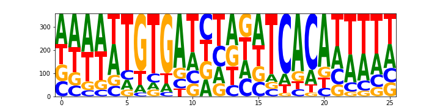
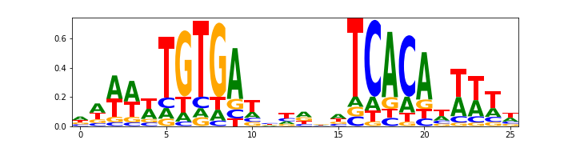
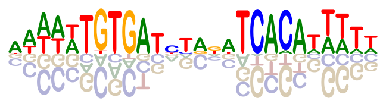

Tutorials
=========

Make an counts logo
~~~~~~~~~~~~~~~~~~~
::

    import numpy as np
    import pandas as pd
    import matplotlib.pyplot as plt

    %matplotlib inline
    plt.ion()

    import logomaker

    # Load CRP binding site sequences
    with open('../data/crp_sites.fasta','r') as f:
        seqs = [l.strip() for l in f.readlines() if '>' not in l and len(l.strip())>0]

    # Preview sequences
    print('There are %d sequences, all of length %d'%(len(seqs), len(seqs[0])))
    seqs[:5]

There are 358 sequences, all of length 26:

|
    'ATAAGCAGGATTTAGCTCACACTTAT'
|
    'AAAAATGTGATACCAATCACAGAATA'
|
    'ATATTGGTGATCCATAAAACAATATT'
|
    'ATATTGGTGAGGAACTTAACAATATT'
|
    'GATTATTTGCACGGCGTCACACTTTG'

::

    # Alignment -> Counts matrix
    counts_df = logomaker.alignment_to_matrix(seqs)
    logo = logomaker.Logo(counts_df)

Transform to a probability logo
~~~~~~~~~~~~~~~~~~~~~~~~~~~~~~~
::

    counts_df = logomaker.alignment_to_matrix(seqs, to_type='probability')

    logo = logomaker.Logo(counts_df,
                          color_scheme='purple',
                          fade_probabilities=True,
                          show_spines=False,
                          font_name='Impact')

Make and information logo
~~~~~~~~~~~~~~~~~~~~~~~~~
::

    # Counts matrix -> Information matrix
    info_mat = logomaker.transform_matrix(counts_mat,
                                         background=background,
                                         from_type='counts',
                                         to_type='information')
    logomaker.Logo(info_mat)

Make an enrichment logo
~~~~~~~~~~~~~~~~~~~~~~~~
::

    # Convert seuqenes to weight matrix
    weight_df = logomaker.alignment_to_matrix(seqs, to_type='weight', center_weights=True)

    # preview weight matrix
    weight_df.head()

+-----+-----------+-----------+----------+----------+
| pos |    A      |    C      |     G    |     T    |
+=====+===========+===========+==========+==========+
| 0   |  0.201587 | 0.067196  | 0.067196 | 0.067196 |
+-----+-----------+-----------+----------+----------+
| 1   |  0.201587 | 0.067196  | 0.067196 | 0.067196 |
+-----+-----------+-----------+----------+----------+
| 2   | -0.10637  | -0.167351 | 0.13686  | 0.13686  |
+-----+-----------+-----------+----------+----------+
| 3   |  0.287282 | 0.041222  | -0.2039  | 0.44996  |
+-----+-----------+-----------+----------+----------+
| 4   | -0.056109 | -0.871858 | 0.344537 | 0.583429 |
+-----+-----------+-----------+----------+----------+

::

    fig, ax = plt.subplots(figsize=[6.5,1.5])

    # Create counts matrix
    logo = logomaker.Logo(weight_df,
                          ax=ax,
                          center_values=False,
                          fade_below=.7,
                          shade_below=.5,
                          font_name='Arial Rounded MT Bold')

    # Style axes
    logo.style_spines(visible=False)
    ax.set_xticks([])
    ax.set_yticks([])

    # Tight layout
    plt.tight_layout()

    # Save as pdf
    out_file = out_prefix+'.pdf'
    fig.savefig(out_file)
    print('Done! Output written to %s.'%out_file)

